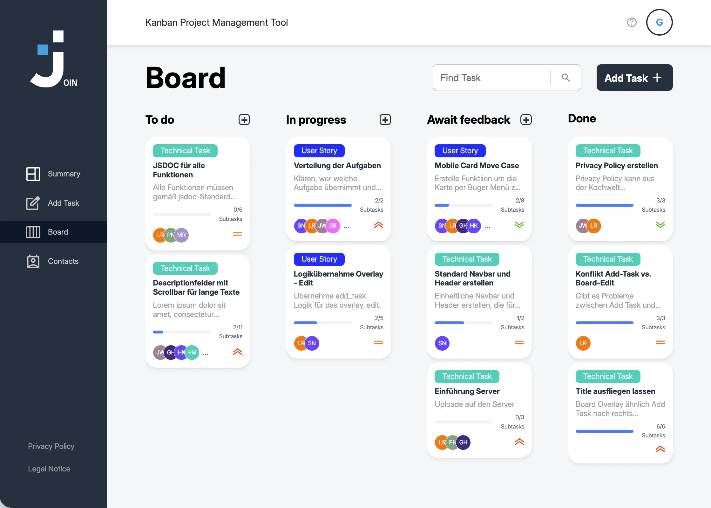

# Join

<p align="center">
  
</p>

Join ist eine browserbasierte Kanban Anwendung für Teams und Einzelpersonen, die Aufgaben klar strukturieren, Zuständigkeiten sichtbar machen und Arbeitsstände direkt im Board nachvollziehen wollen. Die App deckt den kompletten Weg von Login und Registrierung bis zur Verwaltung von Kontakten, Aufgaben und Statuswechseln ab.

Die Anwendung wurde als praxisnahes Frontend Projekt im Rahmen der Developer Akademie umgesetzt. Der Schwerpunkt lag auf einer sauberen Mehrseiten Struktur, verständlicher Benutzerführung, direkter Datenpersistenz über Firebase und einem responsiven Interface in Vanilla JavaScript.

## Funktionsumfang

1. Login, Registrierung und Gastzugang für einen schnellen Einstieg.
2. Summary Ansicht mit persönlicher Begrüssung, Kennzahlen und nächster dringender Frist.
3. Board mit Suche, Statusspalten, Ziehen und Ablegen sowie Detailansicht mit Bearbeitung und Löschen.
4. Aufgabenanlage mit Priorität, Kategorie, Fälligkeitsdatum, Kontakten und Subtasks.
5. Kontaktverwaltung mit alphabetischer Gruppierung, Detailansicht sowie Erstellen, Bearbeiten und Löschen.
6. Mobile Anpassungen für mehrere Seiten, damit die App auch auf kleineren Displays nutzbar bleibt.

## Technische Umsetzung

1. HTML für die Seitenstruktur.
2. CSS mit aufgeteilten Dateien für Layout, Komponenten und responsive Bereiche.
3. Vanilla JavaScript für Validierung, Rendering, Formlogik und UI Interaktionen.
4. Firebase Realtime Database als Datenquelle für Benutzer, Kontakte und Aufgaben.
5. LocalStorage und SessionStorage für Login Status, Nutzerkontext und Gastmodus.
6. Flatpickr für die Datumsauswahl im Aufgabenformular.

## Projektstruktur

1. [index.html](./index.html) enthält den Einstieg mit Login und Weiterleitung in die App.
2. [html](./html) bündelt die Ansichten für Summary, Board, Add Task, Contacts sowie Hilfe und Rechtliches.
3. [js](./js) enthält die Seitenlogik, Template Funktionen und Datenzugriffe.
4. [css](./css) enthält die Styles für Seiten, Komponenten und responsive Anpassungen.
5. [assets](./assets) enthält Logos, Icons und Schriftarten.

## Lokal starten

1. Repository klonen

```bash
git clone https://github.com/lee-royromann/join.git
cd join
```

2. Das Projekt über einen lokalen Server starten, zum Beispiel mit Live Server in VS Code oder mit:

```bash
npx serve .
```

3. Die ausgegebene lokale Adresse im Browser öffnen und mit [index.html](./index.html) starten.

Ein direktes Öffnen über file:// ist für dieses Projekt nicht zuverlässig, weil mehrere Styles und Skripte über absolute Pfade wie /css/... und /js/... geladen werden.

## Firebase Konfiguration

Die aktuelle Version greift direkt auf eine konfigurierte Firebase Realtime Database zu. Wenn du eine eigene Instanz verwenden willst, passe die Basis URLs in [js/db.js](./js/db.js), [js/board_data.js](./js/board_data.js), [js/add_task.js](./js/add_task.js) und [js/summary.js](./js/summary.js) an.

## Hintergrund

Für mich war Join vor allem eine Übung darin, eine grössere Frontend Anwendung ohne Framework sauber zu strukturieren. Besonders wichtig waren mir nachvollziehbare Zuständigkeiten im Code, eine klare Trennung zwischen Oberfläche und Datenlogik und ein Bediengefühl, das auch bei vielen Interaktionen stabil bleibt.
